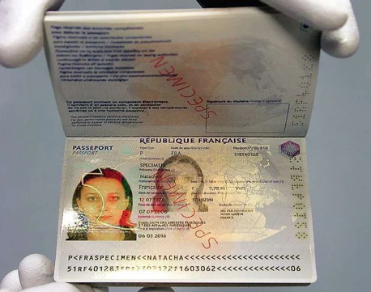
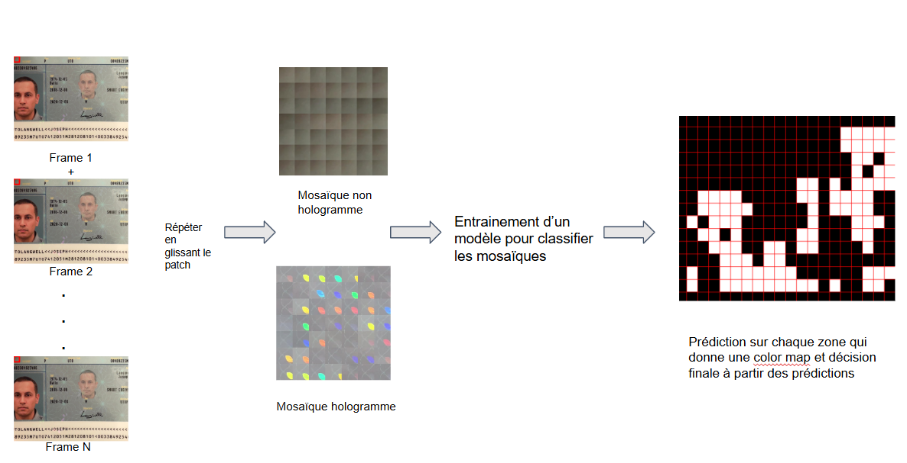
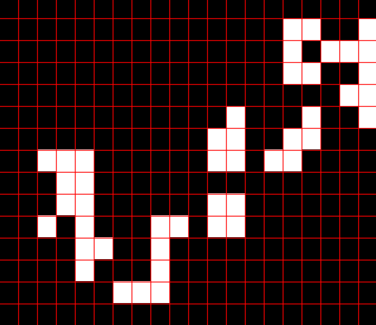
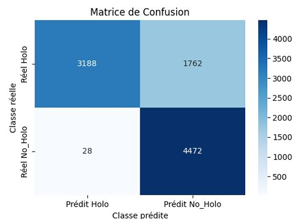
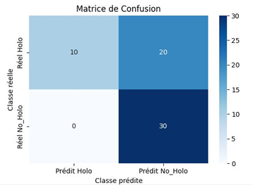

# Détection d'hologramme (à partir de vidéos)
# Approche par patch

## Objectifs
Le but de ce projet est de pouvoir détecter la présence d'un hologramme sur un passeport et de déterminer si le document est authentique ou s'il s'agit d'une fraude. 
Pour cela, on s'est servi d'un dataset MIDV-Holo qui possède des vidéos de passeport prise à l'aide de smartphones. A partir des frames de ces vidéos, on essayera de créer des mosaïques qui représentent l'évolution d'une zone locale sur un passeport.

Exemple d'un passeport français contenant un hologramme de la France

## Dataset

## Méthodologie

On utilise un patch de 200x200 pixels sur les frames d'une vidéo. On récupère ces vignettes que l'on concatenera sur une image pour obtenir une mosaïque qui montre l'évolution de cette zone au cours de la vidéo. On glisse le patch pour essayer de créer un maximum de mosaïques. Ces mosaïques contenant de l'hologramme ou non constitueront un dataset pour entrainer un modèle CNN pour classifier ces mosaïques. Le modèle essayera de prédire localement sur de nouvelles vidéos si il y a un bout d'hologramme. On peut ensuite créer une color map de ces prédictions :

## Résultats

## Bibliographie

LI Koliaskina et al. “MIDV-Holo : A Dataset for ID Document Hologram Detection in a Video Stream”. In : International Conference on Document Analysis and Recognition. Springer. 2023, p. 486-503. doi : https://doi.org/10.1007/978-3-031-41682-8_30.

Harshal Chaudhari, Rishikesh Kulkarni et M.K. Bhuyan. “Weakly Supervised Learning based Reconstruction of Planktons in Digital In-line Holography”. In : Digital Holography and 3-D Imaging 2022. Optica Publishing Group, 2022, W5A.6. doi : 10.1364/DH.2022.W5A.6. url : https://opg.optica.org/abstract.cfm?URI=DH-2022-W5A.6.
