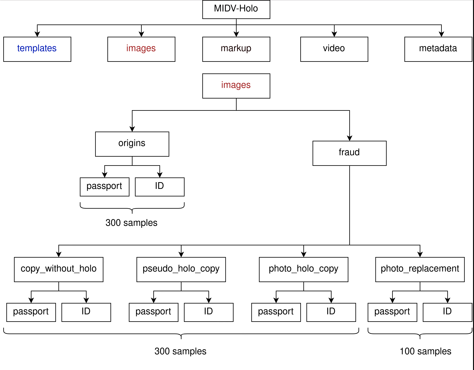
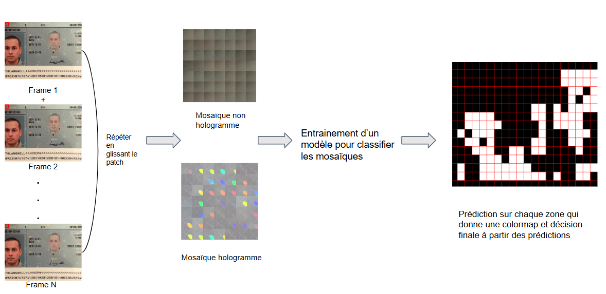
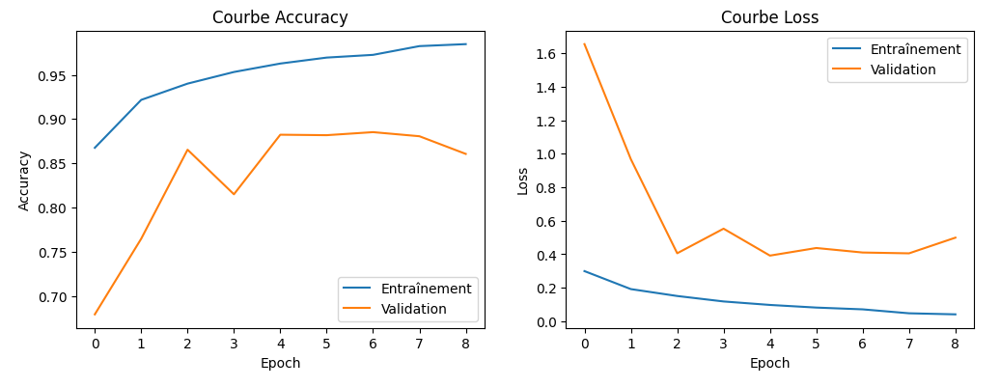
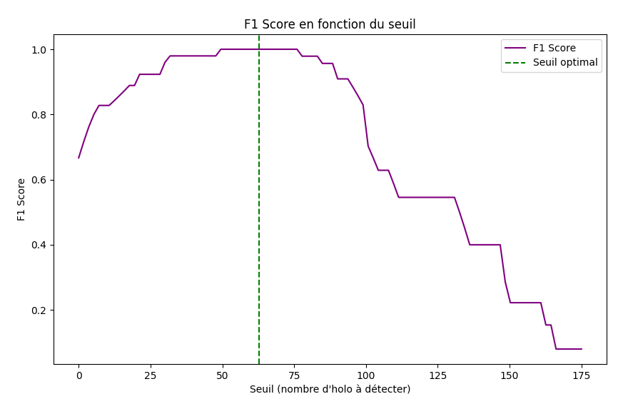

# Détection d'hologramme (à partir de vidéos) / Approche par patch

## Objectifs
Le but de ce projet est de pouvoir détecter la présence d'un hologramme sur un passeport et de déterminer si le document est authentique ou s'il s'agit d'une fraude. 
Pour cela, on s'est servi d'un dataset MIDV-Holo qui possède des vidéos de passeport prise à l'aide de smartphones. A partir des frames de ces vidéos, on essayera de créer des mosaïques qui représentent l'évolution d'une zone locale sur un passeport.

Exemple d'un passeport français contenant un hologramme de la France

## Dataset

Le dataset utilisé pour créer les mosaïques est celui de MIDV-Holo.

[Lien du dataset](https://github.com/SmartEngines/midv-holo)

Le dataset se compose comme ci:

Il contient des vidéos type origins et des vidéos type fraude:
Pour les fraudes, il existe 4 types: copy_without_holo, pseudo_holo_copy, photo_holo_copy et photo_replacement.
Il existe également des fichiers JSON pour chaque frames qui permettent de réaliser une homographie pour pouvoir travailler uniquement sur le passeport.
Dans le dossier "Outils", il existe un script homography.py qui permet de visualier l'homographie d'une vidéo.

## Méthodologie

Nous utilisons un patch de 200x200 pixels sur les images d'une vidéo. Nous récupérons ces vignettes que nous concaténerons sur une image pour obtenir une mosaïque qui montre l'évolution de cette zone au cours de la vidéo. Ensuite nous glissons le patch pour essayer de créer un maximum de mosaïques. Ces mosaïques contenant de l'hologramme ou non constitueront un dataset pour entraîner un modèle CNN afin de classifier ces mosaïques.

Pour créer les mosaïques, le dossier "Création mosaiques" contient un script create_dataset.py qui permet de créer des mosaiques hologrammes à partir des vidéos origins et un script create_fraud.py qui permet de créer des mosaiques non hologramme à partir des vidéos fraude.
La répartition des vidéos pour la construction du dataset s'est fait en copiant celui réaliser dans [le papier](https://arxiv.org/pdf/2404.17253).

L'entrainement du modèle peut-être consulté dans le script jupyter train.ipynb. Le modèle utilisé est MobilenetV2, celui-ci a été fine-tuné sur le dataset de mosaïques.

Après l'entrainement, le modèle essayera de prédire localement sur de nouvelles vidéos si il y a un bout d'hologramme. On peut ensuite créer une color map de ces prédictions :

## Inference

Pour l'inference, il faut calculer un seuil qui puisse indiquer si le passeport est vrai ou bien un faux en fonction des prédictions locales.
Le dossier "Inference" contient un script seuilf1.py, qui calcule ce seuil sur les données de validation en fonction du f-score.

Les données de validation ont été obtenues à partir du script validation.ipnyb qui utilise le modèle sur les données de validation et récupère le nombre de mosaïques prédites hologrammes pour chaque vidéo.

## Résultats

Voici les résultats obtenus au niveau mosaïques sur les données de tests:

Voici les résultats obtenus au niveau vidéos sur les données de tests:

Le modèle n'arrive pas toujours à bien détecter si un passeport est vrai. Si on regarde dans le script test, on peut voir que certaines vidéos sont en fait proche du seuil mais juste légèrement en dessous. Les causes sont principalement un problème au niveau de l'éclairage dans les vidéos ou bien que l'hologramme ne soit pas assez visibles. 
Cependant, les résultats sont très bons pour les fraudes où la méthode arrive à les détecter à 100%.

## Bibliographie

LI Koliaskina et al. “MIDV-Holo : A Dataset for ID Document Hologram Detection in a Video Stream”. In : International Conference on Document Analysis and Recognition. Springer. 2023, p. 486-503. doi : https://doi.org/10.1007/978-3-031-41682-8_30.

Harshal Chaudhari, Rishikesh Kulkarni et M.K. Bhuyan. “Weakly Supervised Learning based Reconstruction of Planktons in Digital In-line Holography”. In : Digital Holography and 3-D Imaging 2022. Optica Publishing Group, 2022, W5A.6. doi : 10.1364/DH.2022.W5A.6. url : https://opg.optica.org/abstract.cfm?URI=DH-2022-W5A.6.
